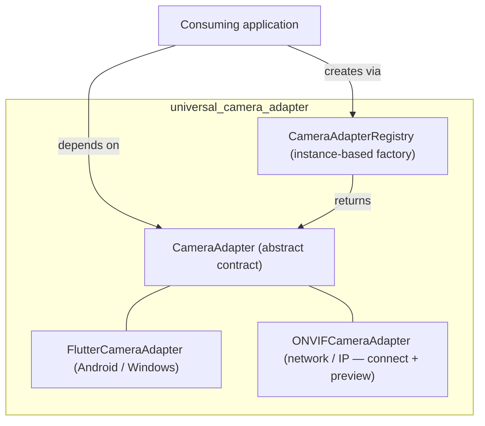

# Universal Camera Adapter

[](https://opensource.org/licenses/MIT)

**A modular, pluggable camera abstraction for Flutter** – unify local device cameras (Android,
Windows webcams) and external network/IP cameras (ONVIF/RTSP) behind a single, testable interface.

---

## Overview

`universal_camera_adapter` abstracts camera hardware behind one `CameraAdapter` contract, whether
it's:

- **Built-in phone cameras** (Android via `camera_android`)
- **Laptop webcams** (Windows via `camera_windows`, using the federated `camera` plugin)
- **External network/IP cameras** (ONVIF/RTSP — *connect + live preview implemented; discovery, PTZ,
  and snapshot capture still planned*)

It uses the **Adapter Pattern** + **Registry Pattern** so consumers code against the interface, not
concrete backends.

> **Platform support today:** Android and Windows are fully supported. macOS and Linux are not
> implemented. The ONVIF/IP-camera backend is **partially implemented** — connect (authenticated) and
> live RTSP preview work and are hardware-verified; WS-Discovery, PTZ, and snapshot capture are still
> planned (see the [Roadmap](#roadmap) and [`docs/plan/ROADMAP.md`](docs/plan/ROADMAP.md) for exact
> per-method status).

## Architecture



## Core design principles

1. **Interface-first** — consumers code against `CameraAdapter`, never a concrete backend.
2. **Capabilities are queried at runtime** — never assume PTZ/zoom/focus; ask the adapter *after* `open()`.
3. **Lazy initialisation** — backends touch their SDK/plugin only inside `open()`.
4. **Map, don't leak** — backend exceptions map to a small typed surface
   (`StateError`, `UnsupportedError`, `TimeoutException`, `FormatException`).
5. **One active device per instance** — `open()` auto-`close()`s the previous device.
6. **Explicit timeouts** — every network-bound method accepts an optional `Duration timeout` (default 15s).

## The contract

```dart
abstract class CameraAdapter {
  Future<List<CameraDevice>> listDevices();

  Future<void> open(CameraDevice device, {Duration timeout});
  Future<void> close();
  bool get isOpen;

  CameraCapabilities get capabilities;         // throws StateError if not open

  Widget buildPreview();                        // throws StateError if not open
  Future<Uint8List> captureFrame({Duration timeout});

  Future<void> setZoom(double factor, {Duration timeout});
  Future<void> setPan(double angle, {Duration timeout});   // UnsupportedError if no PTZ
  Future<void> setTilt(double angle, {Duration timeout});  // UnsupportedError if no PTZ
}
```

`captureFrame()` returns raw image bytes (usually JPEG). `buildPreview()` returns a live-feed
widget — **the consumer must call `close()`** (e.g. in `dispose()`) to release resources.

The contract also exposes a `featureMatrix` getter for tri-state capability discovery
(`supported` / `unvalidated` / `unsupported`) — see [`docs/camera/feature-matrix.md`](docs/camera/feature-matrix.md).

## Registry (pluggable backends)

The `CameraAdapterRegistry` is **instance-based** (not a singleton), so each app or test builds its
own isolated registry.

```dart
void main() {
  final registry = CameraAdapterRegistry();
  registry.register('builtin', FlutterCameraAdapter.new, asDefault: true);
  registry.register('onvif', ONVIFCameraAdapter.new);   // connect + live RTSP preview
  runApp(MyApp(registry: registry));
}

// In a widget/controller:
final adapter = registry.hasDefault() ? registry.createDefault() : registry.create('builtin');
```

The example app pairs this with a parallel `CameraSetupWizardRegistry`, so a user can add ONVIF (and
the example's EZVIZ) cameras through the Cameras tab with no per-brand branching in the UI — see
[`docs/camera/add-camera-wizard.md`](docs/camera/add-camera-wizard.md).

## Error handling (the typed surface)

| Backend condition | Mapped Dart error |
| :--- | :--- |
| Device disconnected / open or capture failure / permission denied | `StateError` |
| Feature not supported by hardware | `UnsupportedError` |
| Timeout / network failure | `TimeoutException` |
| Invalid SOAP response / malformed XML | `FormatException` |

```dart
try {
  await adapter.open(device);
} on StateError catch (e) {
  showUserMessage('Camera error: ${e.message}');
} on TimeoutException catch (_) {
  showUserMessage('Camera took too long to respond.');
} on UnsupportedError catch (_) {
  // Feature not available — hide the control.
}
```

## The Golden Rule for consumers

> **Never import a concrete adapter in your UI or business logic. Always go through
> `CameraAdapterRegistry` and always check `capabilities` at runtime.**

1. **Depend on the interface** — `CameraAdapter`, not `FlutterCameraAdapter`.
2. **Capabilities drive the UI** — query `capabilities` after `open()`; show/hide controls dynamically.
3. **Lifecycle is strict** — always pair `open()` with `close()`.
4. **Errors are expected** — handle `StateError`, `UnsupportedError`, `TimeoutException`.

## Testing

Use the provided `MockCameraAdapter` (in `test/`) to simulate every return type and exception, so
you can test business logic without hardware. Run:

```bash
flutter test
```

No live-hardware tests run in CI. Integration against a real Android device or Windows webcam is
manual — see [`example/`](example/).

## Building on Windows

Building for Windows needs **Visual Studio 2022** (or Build Tools 2022) with the **Desktop
development with C++** workload *and* the **C++ ATL** individual component. ATL is not part of the
default C++ workload, and `flutter doctor` reports the toolchain as healthy without it — the failure
only appears at the native compile step:

```
flutter_secure_storage_windows_plugin.cpp(6,10): fatal error C1083:
Cannot open include file: 'atlstr.h': No such file or directory
```

`flutter_secure_storage` (the default `CameraSecretStore` backend) needs ATL to talk to the Windows
Credential Manager. Add it via **Visual Studio Installer → Modify → Individual components →** search
`ATL` **→ C++ ATL for latest v143 build tools (x86 & x64)**.

Two related gotchas:

- Flutter always selects the **newest** Visual Studio install it can find and offers no override. A
  half-finished VS 2022 alongside a working VS 2019 will be chosen and then fail with *"The current
  Visual Studio installation is incomplete."* Either complete it or remove it.
- After switching VS versions, run `flutter clean`. The generated `CMakeCache.txt` pins the
  generator, so a stale cache fails with *"generator: Visual Studio 17 2022 does not match the
  generator used previously: Visual Studio 16 2019."*

## Backends

| Backend | Purpose | Platforms | Status |
| :--- | :--- | :--- | :--- |
| **FlutterCameraAdapter** | Local cameras (phone, webcam) via the `camera` plugin | Android, Windows | **Production-ready** |
| **ONVIFCameraAdapter** | External IP cameras via ONVIF/RTSP | Cross-platform (network) | **Partial** — authenticated connect (WS-UsernameToken + HTTP Digest) and live RTSP preview work and are hardware-verified; `listDevices` (WS-Discovery), `capabilities`, `captureFrame` (snapshot), and PTZ still throw `UnimplementedError` |
| **EzvizCameraAdapter** *(example app only)* | EZVIZ cloud cameras via native SDK-hosted per-user login | Android | Demo backend — lives in [`example/lib/`](example/), not the published `lib/`; connect + playback work, frame capture is a stub |

See [`docs/camera/camera-integration-architecture.md`](docs/camera/camera-integration-architecture.md)
for the full architecture and the [ONVIF setup guide](docs/camera/onvif-setup-guide.md) for the
network-permission requirements.

## Roadmap

- **v1.0** — core interface, registry, `FlutterCameraAdapter`, mock, tests, CI. *(this release)*
- **Landed since v1.0 (unreleased):** `ONVIFCameraAdapter` authenticated connect + live RTSP preview;
  a tri-state `featureMatrix` on the contract; saved-camera profiles with secure-storage secrets
  (`CameraProfile` / `CameraProfileStore` / `CameraSecretStore`); a modular add-camera wizard
  registry; and an EZVIZ example backend.
- **v1.1 (remaining)** — `ONVIFCameraAdapter`: PTZ, snapshot capture, and WS-Discovery.
- **v1.2** — two-way audio (intercom) for ONVIF.
- **v1.3** — motion/event streams (ONVIF events).
- **v2.0** — macOS/Linux via `camera_macos` / `camera_linux`, if demand arises.

Tracked in [`docs/plan/ROADMAP.md`](docs/plan/ROADMAP.md).

## Contributing

See [CONTRIBUTING.md](CONTRIBUTING.md) and [SECURITY.md](SECURITY.md). New backends must implement
the `CameraAdapter` contract, map exceptions to the typed surface, and ship with mock-based unit
tests.

## License

MIT — see [LICENSE](LICENSE).
